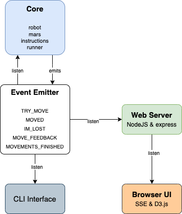

# Martian Robots

[](https://codeclimate.com/github/calbertts/martian-robots/maintainability)
[](https://codeclimate.com/github/calbertts/martian-robots/test_coverage)

Technical test for GuidSmiths

There's a core and two interfaces (CLI and Web).

## Architecture overview



## How to run as CLI tool

### Interactive input
```
docker run --rm -it calbertts/martian-robots:v1
```

### With an input file
```
echo "5 3
1 1 E
RFRFRFRF
3 2 N
FRRFLLFFRRFLL
0 3 W
LLFFFLFLFL" > inputFile

docker run -i --rm calbertts/martian-robots:v1 < inputFile 
```

### Showing more execution details
```
docker run -i --rm -e DETAILED="true" calbertts/martian-robots:v1 < inputFile 
```

### With an input file in a pipeline
```
cat inputFile | docker run -i --rm calbertts/martian-robots:v1
```

## How to run as a web server with an UI locally
```
node app/src/interfaces/server.js
```

A public demo can be checkout here:
https://calbertts-martian-robots.herokuapp.com/


## How to build the Docker image
```
npm run build-docker-image
```
